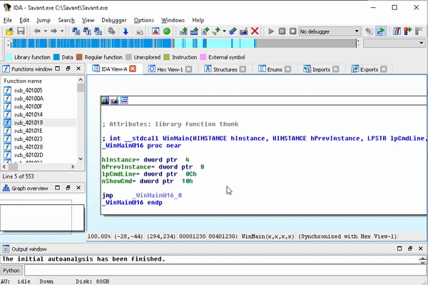

# Dynapstalker

Generate an IDC script to colorize IDA Pro basic blocks using DynamoRIO's drcov output. Inspired by (and IDC script code) taken from Paimei's Pstalker by Pedram Amini, but this is a lot easier to get the output and DynamoRIO is a lot faster for instrumentation.

## Installation

1. Install Python
2. Download DynamoRIO 7 or later from dynamorio.org. Unzip to a directory on your system. Dynapstalker will not work with versions of the `drcov` utility from DynamoRIO prior to DynamoRIO 7.
3. Launch your target app using `drcov`, generating ASCII log file output, as shown: `drrun.exe -t drcov -dump_text -- targetapp.exe `
4. When `targetapp.exe` exits, `drcov` will generate a log file, identifying all the reached blocks.
5. Convert the `drcov` log file to IDA Pro scripting format using `dynapstalker`: `$ python dynapstalker.py sample/drcov.Savant.exe.03632.0000.proc.log savant.exe out.idc`
6. From IDA Pro, click _File | Script File_, navigate to and run the output IDC script. The instrumented blocks identified with `drcov` will change color to yellow by default, or any other color you specify with an RGB code.

## Questions, Comments, Suggestions?

Joshua Wright

josh@wr1ght.net

@joswr1ght
